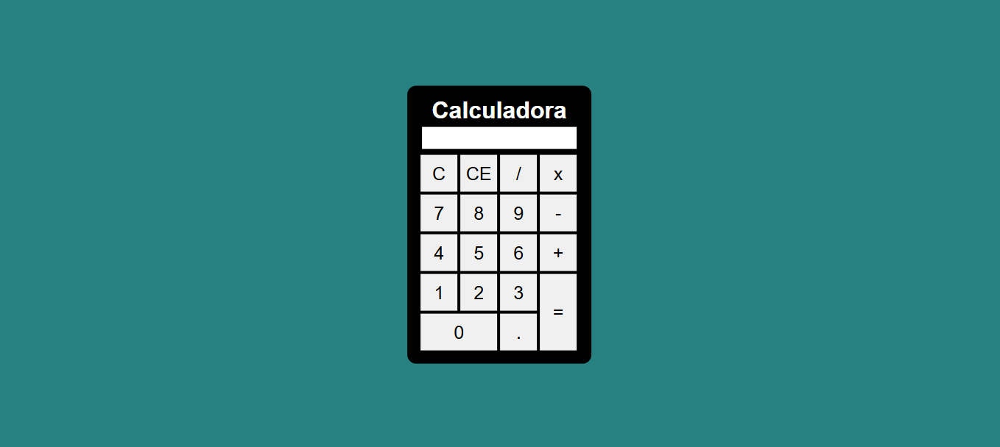

# 🧮 Calculadora Uber - Simples e Eficiente!

Olá, pessoal! 👋 Este repositório contém o código de uma calculadora simples, mas funcional, desenvolvida com HTML, CSS e JavaScript. Perfeita para aqueles cálculos rápidos do dia a dia, sem complicações!

Pronto! A calculadora estará pronta para uso. 🎉

## 🛠️ Como Usar

A interface é bem intuitiva:

* **Números:** Clique nos botões numéricos para inserir os valores.
* **Operações:** Use os botões `+`, `-`, `*` e `/` para realizar as operações matemáticas.
* **Limpar (C):** Clique no botão `C` para limpar o visor e começar um novo cálculo.
* **Apagar (CE):** Clique no botão `CE` para apagar o último caractere inserido.
* **Resultado (=):** Clique no botão `=` para obter o resultado do cálculo.
* **Ponto (.):** Clique no botão `.` para inserir números decimais.

## 💻 Estrutura do Projeto

O projeto é organizado da seguinte forma:

* `index.html`: Contém a estrutura HTML da calculadora.
* `style.css`: Define o estilo visual da calculadora.
* `script.js`: Contém a lógica JavaScript para as operações da calculadora.

## 🎨 Estilo

A calculadora possui um estilo simples e limpo, com um fundo agradável e botões fáceis de usar. O design foi pensado para ser minimalista e funcional.